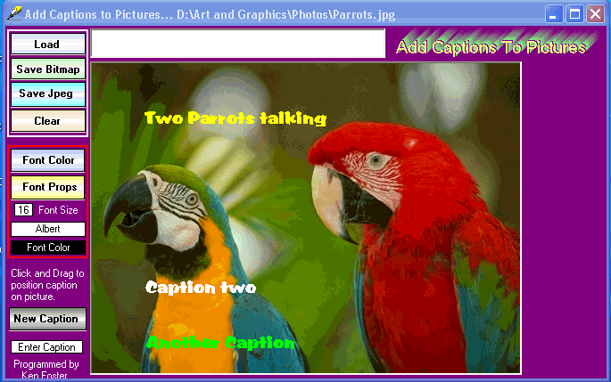



## Captions On Pictures \(Updated\)

### Description

Add captions to your pictures.Can save as bitmap or jpeg.Uses cJpeg class for saving jpegs.I hope you will try it and see if you like it.I've updated ,so now you can delete captions as well.Made a few other small changes also.
 
### More Info
 

             |
---                |---
**Submitted On**   |2005-10-11 08:39:16
**By**             |[Kenneth Foster](https://github.com/Planet-Source-Code/PSCIndex/blob/master/ByAuthor/kenneth-foster.md)
**Level**          |Intermediate
**User Rating**    |5.0 (10 globes from 2 users)
**Compatibility**  |VB 6\.0
**Category**       |[Complete Applications](https://github.com/Planet-Source-Code/PSCIndex/blob/master/ByCategory/complete-applications__1-27.md)
**World**          |[Visual Basic](https://github.com/Planet-Source-Code/PSCIndex/blob/master/ByWorld/visual-basic.md)
**Archive File**   |[Captions\_O19395410112005\.zip](https://github.com/Planet-Source-Code/kenneth-foster-captions-on-pictures-updated__1-62760/archive/master.zip)

